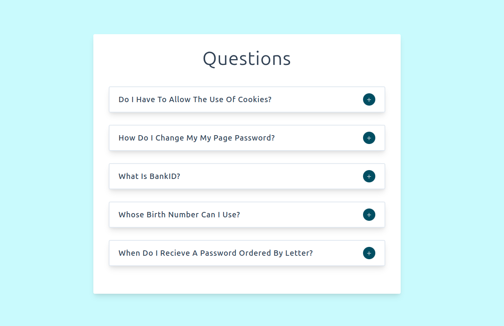

# Question Accordion UI❓


A React practice project focused on building an interactive FAQ accordion component. Features clean toggle functionality with the ability to display only one answer at a time.



## ✨ Features

- **Single Question Display** - Only one answer visible at a time for clean user experience
- **Smooth Toggle Animation** - Interactive expand/collapse functionality
- **React Icons Integration** - Visual indicators with plus/minus icons
- **Responsive Design** - Optimized for all device sizes
- **State Management** - Efficient component communication through props

## 💡 Key Learnings / Implemented Challenges

This project was created to complete specific challenges focused on foundational React concepts:

- **Component Communication** - Sharing data and callback functions between parent and child components via props
- **useState Hook** - Managing active question state and toggle functionality
- **Conditional Rendering** - Dynamically showing/hiding answer content
- **Component Hierarchy** - Building structured parent-child component relationships
- **Event Handling** - Implementing click events for interactive toggles
- **Data Management** - Importing and utilizing static question data
- **Lifting State Up** - Managing state at the top level for better control
- **Icon Integration** - Incorporating React Icons for enhanced UI

## 🧰 Built With

- Vite + React
- JavaScript (ES6+)
- HTML5 & CSS3
- React Icons

## ▶️ Live Demo

**View Live on Netlify:**
[Click here](https://question-accordion-ui-gpdev.netlify.app/)

## 🎨 Design

Figma design provided by the course instructor:[ Preview here](https://www.figma.com/file/TAwJ3kWOqkw0o8UVtAMOHO/Accordion?node-id=0%3A1&t=1YEti8xBykw69tBH-1)

## 📦 Getting Started

### Prerequisites

- **Node.js ≥ 18**
- **npm or yarn**

### Installation

1. Clone the repository

```bash
git clone https://github.com/pro804/Question-Accordion-UI.git
```

2. Navigate to the project directory

```bash
cd Question-Accordion-UI
```

3. Install dependencies

```bash
npm install
```

4. Start the development server

```bash
npm run dev
```

5. Open http://localhost:5173 to view it in the browser.

## 🔧 Scripts

- `npm run dev` — Runs the development server (Vite)
- `npm run build` — Builds the app for production
- `npm run preview` — Previews the production build locally

## 📄 License

This project is created for educational purposes as part of a React learning journey.
